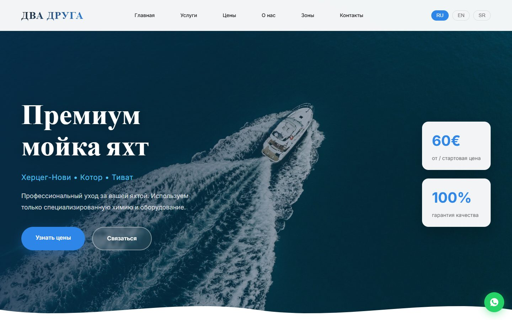
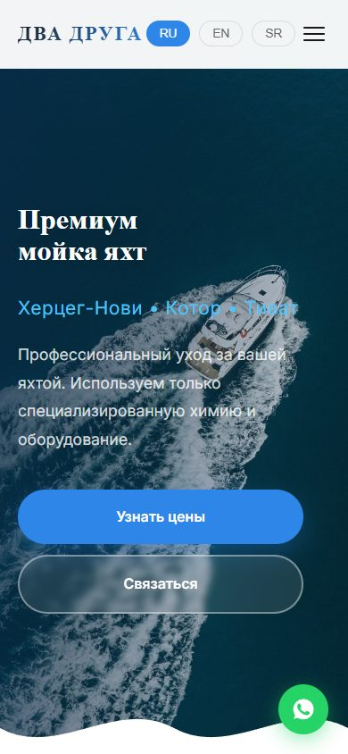

# Dva Druga — yacht cleaning in Montenegro

Multilingual website for a yacht cleaning and detailing service in the Bay of Kotor (Herceg Novi, Kotor, Tivat).

**Live:** https://2druga.netlify.app


<table>
  <tr>
    <td width="72%"></td>
    <td width="28%"></td>
  </tr>
</table>

## Highlights

- **Three languages (RU / EN / SR)** with a switcher in the navbar, no framework and no build step.
- **8 pages:** home, services, pricing, about, contact, plus a landing page for each city (local SEO).
- **SEO:** unique title / description / OpenGraph / canonical per page, `LocalBusiness` JSON-LD with prices and service areas, `sitemap.xml`, `robots.txt`.
- **Performance:** images moved out of inline base64 into files, which cut total HTML from ~1.8 MB to ~0.3 MB.
- **Progressive enhancement:** scroll reveals and count-up counters in a small `enhance.js`, respecting `prefers-reduced-motion`.
- **Conversion:** WhatsApp / Telegram / phone contacts on every page.

## Run

Static site: open `index.html`, or serve the folder:

```bash
python -m http.server 8000
```

---

**По-русски:** сайт сервиса мойки и ухода за яхтами в Боке Которской. Чистый HTML/CSS/JS, три языка, отдельные страницы под каждый город, SEO-разметка LocalBusiness, деплой на Netlify.

Автор: Telegram [@uprtrk](https://t.me/uprtrk)
